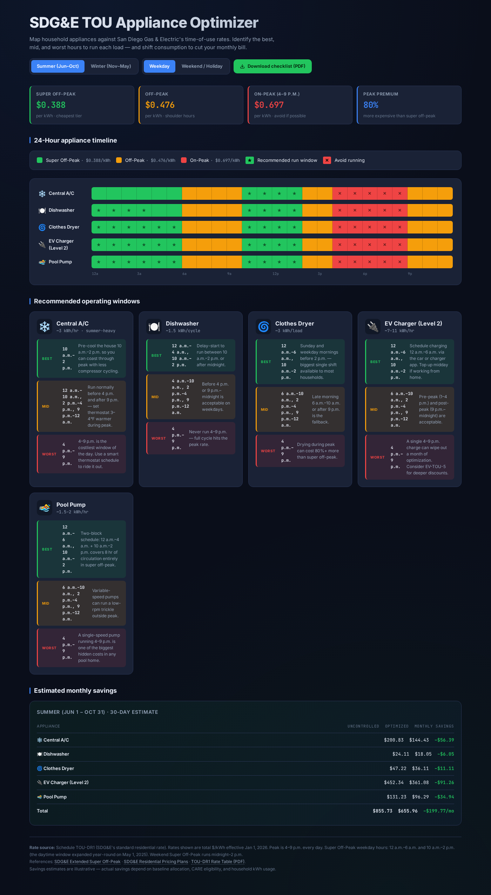

# SDG&E TOU Optimizer & Live Rate Monitor

An interactive, real-time web application to track San Diego Gas & Electric (SDG&E) electricity rates live, visualize 24-hour Time-of-Use (TOU) schedules, optimize household appliance run windows, and maximize monthly bill savings.



---

## ⚡ Features

### 1. Real-Time Live Rate HUD
- **Live Rate Tracking:** Displays the active electricity pricing right now (in ¢/kWh and $/kWh).
- **Countdown to Next Period:** Real-time countdown timer to the next rate window (e.g., *"Switches to Super Off-Peak in 1h 36m at 12:00 AM"*).
- **Live Actionable Advice:** Instant recommendation on whether high-draw appliances should be run or delayed.
- **Instant Hourly Running Cost Calculator:** Live estimated operating cost per hour for Central A/C, Level 2 EV charging, clothes dryer, and dishwasher cycles.

### 2. Live 24-Hour Timeline Needle
- A vertical illuminated progress indicator marks the exact current hour and minute across the 24-hour appliance timeline.
- Highlights the current hour cell and visualizes upcoming rate blocks at a glance.

### 3. Multi-Plan Tariff Support
Full support for primary SDG&E residential rate schedules:
- **TOU-DR1 (Standard Residential TOU):** 3-period rate (Super Off-Peak, Off-Peak, On-Peak).
- **EV-TOU-5 (Electric Vehicle / Battery Owners):** 3-period rate featuring an ultra-low Super Off-Peak rate (~$0.131/kWh) for EV charging.
- **TOU-DR2 (Two-Period TOU):** Simple 2-period structure (4–9 p.m. On-Peak and Off-Peak).

### 4. Auto-Calendar & Holiday Detection
- **Auto-Sync Mode:** Automatically detects the current season:
  - **Summer:** June 1 – October 31
  - **Winter:** November 1 – May 31
- Automatically identifies weekends and California/SDG&E statutory holidays (New Year's, Presidents' Day, Memorial Day, Independence Day, Labor Day, Veterans Day, Thanksgiving, Christmas) which qualify for extended weekend Super Off-Peak hours (midnight to 2 p.m.).
- Supports manual override with an instant "Live Synced" snap-back toggle.

### 5. Custom Rates & CCA Support
- Includes a built-in **Rate Customizer** modal to adjust exact $/kWh rates.
- Ideal for customers enrolled in **San Diego Community Power (SDCP)**, Clean Energy Alliance (CEA), or receiving **California Alternate Rates for Energy (CARE)** discounts.
- Custom rates are stored locally via `localStorage` and persist across sessions.

### 6. Appliance Scheduling & Blackout Constraints
- **Custom Schedule Constraints:** Set sleep and away/work hours to eliminate impractical recommendation windows.
- **Automated vs. Attended Loads:** Set-and-forget loads (EV charger, pool pump, dishwasher delay-start, A/C pre-cooling) can bypass work/sleep blackouts while attended loads (clothes dryer) strictly respect household safety guidelines.
- **Live Status Badges:** Each appliance card dynamically displays its status at this exact moment (`Run Now (Cheapest)`, `Avoid Right Now`, `OK to Run`, or `Schedule Blackout`).

### 7. Exportable PDF Schedule
- One-click client-side PDF generator (via jsPDF) producing a branded 1-page operating schedule and appliance checklist to post by your electrical panel or refrigerator.

### 8. Cloudflare R2 Bill & Schedule Vault
- **Zero-Egress Storage:** Upload and store SDG&E PDF bills, Green Button CSV interval meter logs, or exported TOU schedule snapshots directly into Cloudflare R2.
- **Dual Architecture Support:**
  - **Cloudflare Pages Functions:** Zero-config API routes in `functions/api/upload.js` and `functions/api/files.js` with direct `R2_BUCKET` binding.
  - **Standalone Worker:** Included `worker/worker.js` and `worker/wrangler.toml` for deploying a dedicated backend microservice via `npx wrangler deploy`.
- **Local Fallback Staging:** Files stage locally in the browser until your Cloudflare R2 Worker is connected, ensuring zero upload failures.

---

## 📊 SDG&E Time-of-Use Windows Overview

| Pricing Period | Weekdays | Weekends & Holidays | Typical Rate Spread |
| :--- | :--- | :--- | :--- |
| **Super Off-Peak** *(Lowest)* | Midnight – 6:00 a.m.<br>10:00 a.m. – 2:00 p.m.* | Midnight – 2:00 p.m. | ~$0.131 – $0.449 / kWh |
| **Off-Peak** *(Shoulder)* | 6:00 a.m. – 10:00 a.m.<br>2:00 p.m. – 4:00 p.m.<br>9:00 p.m. – Midnight | 2:00 p.m. – 4:00 p.m.<br>9:00 p.m. – Midnight | ~$0.476 – $0.540 / kWh |
| **On-Peak** *(Highest)* | **4:00 p.m. – 9:00 p.m.** | **4:00 p.m. – 9:00 p.m.** | ~$0.622 – $0.802 / kWh |

*\*Note: The weekday 10 a.m. – 2 p.m. midday Super Off-Peak window was made year-round by SDG&E effective May 2025/2026.*

---

## ☁️ Cloudflare R2 Setup

### Option A: Cloudflare Pages (Recommended - Zero Config)
1. In your Cloudflare Dashboard, open your Pages project (`peak-loads`).
2. Go to **Settings > Functions > R2 bucket bindings**.
3. Add a binding:
   - **Variable name:** `R2_BUCKET`
   - **R2 bucket:** Select (or create) your bucket (e.g., `sdge-vault`).
4. Re-deploy or push a commit. The `/api/upload` endpoint will automatically store files in your R2 bucket.

### Option B: Standalone Worker
1. Create an R2 bucket in Cloudflare: `npx wrangler r2 bucket create sdge-vault`
2. Deploy the worker:
   ```bash
   cd worker
   npx wrangler deploy
   ```
3. Copy your worker URL (e.g. `https://peak-loads-r2-worker.workers.dev/api/upload`) and paste it in the web app under **R2 Storage > Worker: /api/upload**.

---

## 🚀 Getting Started

This application is built as a zero-dependency, pure static web client (`HTML5`, `CSS3`, `vanilla JavaScript`).

### Quick Start
Simply open `index.html` directly in any web browser:

```bash
# On Windows PowerShell:
Start-Process index.html

# Or run a local HTTP server:
npx serve .
# or
python -m http.server 8080
```

Open [http://localhost:8080](http://localhost:8080) in your browser.

---

## 📁 Project Structure

```
peak-loads/
├── index.html                   # Core web application UI, styles & R2 vault
├── app.js                       # Live rate engine, TOU logic, and R2 client
├── functions/                   # Cloudflare Pages Functions
│   └── api/
│       ├── upload.js            # POST /api/upload handler
│       ├── files.js             # GET /api/files handler
│       └── files/[key].js       # GET /api/files/:key file retrieval
├── worker/                      # Standalone Cloudflare Worker alternative
│   ├── worker.js                # ES module worker for R2
│   └── wrangler.toml            # Wrangler configuration & R2 bindings
├── .gitignore                   # Git ignore configuration
├── README.md                    # Project documentation
├── preview.png                  # Application UI screenshot
├── SDGE-TOU-Schedule.pdf        # Sample exported schedule PDF
└── SDGE-TOU-Appliance-Checklist.pdf # Printable appliance checklist
```
├── SDGE-TOU-Schedule.pdf        # Sample exported schedule PDF
└── SDGE-TOU-Appliance-Checklist.pdf # Printable appliance checklist
```

---

## 🔗 Official References & Tariffs
- [SDG&E Residential Pricing Plans](https://www.sdge.com/residential/pricing-plans)
- [SDG&E Current Effective Tariffs (CPUC Filings)](https://www.sdge.com/rates-and-regulations/current-and-effective-tariffs)
- [SDG&E Extended Super Off-Peak Information](https://www.sdge.com/super-off-peak-residential)
- [San Diego Community Power (SDCP) Tariffs](https://sdcommunitypower.org)
